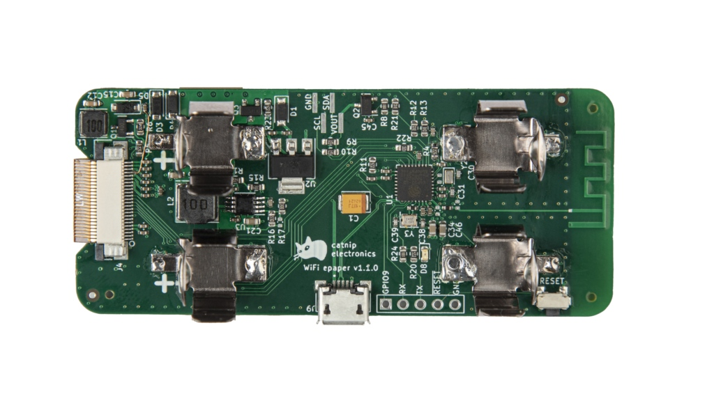

# Paper-WiFi

Wifi-enabled e-paper display for I2C sensors. Arduino compatible software on Platformio. 3D printable case.

## Specifications

 * MCU: ESP32C3
 * Power supply: 2xAA, 3V
 * Sleep current: 38uA
 * Screen size: 2.13"
 * Display resolution: 212(H) × 104(V) pixels
 * Connectivity: I2C, UART over USB, UART
 * GPIO: 2 
 * Sensors: Temperature, Relative humidity
 * Temperature accuracy: 0.2°C typical
 * Relative humidity accuracy: 1.8% typical

## Programming instructions

Firmware build and upload process is managed by [Platformio](https://platformio.org). Most probably you will encounter the board in deep sleep in which it is not visible via USB. Jump GPIO9 to GND and reset the board to put it into bootloader mode. Run `pio run -t upload` to compile and upload firmware. Remove jumper and reset the board to run. If deep sleep is not used, board can be programmed without GPIO9 jumper.

## Licence

[CERN Open Hardware Licence Version 2 - Strongly Reciprocal](https://ohwr.org/cern_ohl_s_v2.txt)

![Build with PlatformIO](https://img.shields.io/badge/build%20with-PlatformIO-orange?logo=data%3Aimage%2Fsvg%2Bxml%3Bbase64%2CPHN2ZyB3aWR0aD0iMjUwMCIgaGVpZ2h0PSIyNTAwIiB2aWV3Qm94PSIwIDAgMjU2IDI1NiIgeG1sbnM9Imh0dHA6Ly93d3cudzMub3JnLzIwMDAvc3ZnIiBwcmVzZXJ2ZUFzcGVjdFJhdGlvPSJ4TWlkWU1pZCI+PHBhdGggZD0iTTEyOCAwQzkzLjgxIDAgNjEuNjY2IDEzLjMxNCAzNy40OSAzNy40OSAxMy4zMTQgNjEuNjY2IDAgOTMuODEgMCAxMjhjMCAzNC4xOSAxMy4zMTQgNjYuMzM0IDM3LjQ5IDkwLjUxQzYxLjY2NiAyNDIuNjg2IDkzLjgxIDI1NiAxMjggMjU2YzM0LjE5IDAgNjYuMzM0LTEzLjMxNCA5MC41MS0zNy40OUMyNDIuNjg2IDE5NC4zMzQgMjU2IDE2Mi4xOSAyNTYgMTI4YzAtMzQuMTktMTMuMzE0LTY2LjMzNC0zNy40OS05MC41MUMxOTQuMzM0IDEzLjMxNCAxNjIuMTkgMCAxMjggMCIgZmlsbD0iI0ZGN0YwMCIvPjxwYXRoIGQ9Ik0yNDkuMzg2IDEyOGMwIDY3LjA0LTU0LjM0NyAxMjEuMzg2LTEyMS4zODYgMTIxLjM4NkM2MC45NiAyNDkuMzg2IDYuNjEzIDE5NS4wNCA2LjYxMyAxMjggNi42MTMgNjAuOTYgNjAuOTYgNi42MTQgMTI4IDYuNjE0YzY3LjA0IDAgMTIxLjM4NiA1NC4zNDYgMTIxLjM4NiAxMjEuMzg2IiBmaWxsPSIjRkZGIi8+PHBhdGggZD0iTTE2MC44NjkgNzQuMDYybDUuMTQ1LTE4LjUzN2M1LjI2NC0uNDcgOS4zOTItNC44ODYgOS4zOTItMTAuMjczIDAtNS43LTQuNjItMTAuMzItMTAuMzItMTAuMzJzLTEwLjMyIDQuNjItMTAuMzIgMTAuMzJjMCAzLjc1NSAyLjAxMyA3LjAzIDUuMDEgOC44MzdsLTUuMDUgMTguMTk1Yy0xNC40MzctMy42Ny0yNi42MjUtMy4zOS0yNi42MjUtMy4zOWwtMi4yNTggMS4wMXYxNDAuODcybDIuMjU4Ljc1M2MxMy42MTQgMCA3My4xNzctNDEuMTMzIDczLjMyMy04NS4yNyAwLTMxLjYyNC0yMS4wMjMtNDUuODI1LTQwLjU1NS01Mi4xOTd6TTE0Ni41MyAxNjQuOGMtMTEuNjE3LTE4LjU1Ny02LjcwNi02MS43NTEgMjMuNjQzLTY3LjkyNSA4LjMyLTEuMzMzIDE4LjUwOSA0LjEzNCAyMS41MSAxNi4yNzkgNy41ODIgMjUuNzY2LTM3LjAxNSA2MS44NDUtNDUuMTUzIDUxLjY0NnptMTguMjE2LTM5Ljc1MmE5LjM5OSA5LjM5OSAwIDAgMC05LjM5OSA5LjM5OSA5LjM5OSA5LjM5OSAwIDAgMCA5LjQgOS4zOTkgOS4zOTkgOS4zOTkgMCAwIDAgOS4zOTgtOS40IDkuMzk5IDkuMzk5IDAgMCAwLTkuMzk5LTkuMzk4em0yLjgxIDguNjcyYTIuMzc0IDIuMzc0IDAgMSAxIDAtNC43NDkgMi4zNzQgMi4zNzQgMCAwIDEgMCA0Ljc0OXoiIGZpbGw9IiNFNTcyMDAiLz48cGF0aCBkPSJNMTAxLjM3MSA3Mi43MDlsLTUuMDIzLTE4LjkwMWMyLjg3NC0xLjgzMiA0Ljc4Ni01LjA0IDQuNzg2LTguNzAxIDAtNS43LTQuNjItMTAuMzItMTAuMzItMTAuMzItNS42OTkgMC0xMC4zMTkgNC42Mi0xMC4zMTkgMTAuMzIgMCA1LjY4MiA0LjU5MiAxMC4yODkgMTAuMjY3IDEwLjMxN0w5NS44IDc0LjM3OGMtMTkuNjA5IDYuNTEtNDAuODg1IDIwLjc0Mi00MC44ODUgNTEuODguNDM2IDQ1LjAxIDU5LjU3MiA4NS4yNjcgNzMuMTg2IDg1LjI2N1Y2OC44OTJzLTEyLjI1Mi0uMDYyLTI2LjcyOSAzLjgxN3ptMTAuMzk1IDkyLjA5Yy04LjEzOCAxMC4yLTUyLjczNS0yNS44OC00NS4xNTQtNTEuNjQ1IDMuMDAyLTEyLjE0NSAxMy4xOS0xNy42MTIgMjEuNTExLTE2LjI4IDMwLjM1IDYuMTc1IDM1LjI2IDQ5LjM2OSAyMy42NDMgNjcuOTI2em0tMTguODItMzkuNDZhOS4zOTkgOS4zOTkgMCAwIDAtOS4zOTkgOS4zOTggOS4zOTkgOS4zOTkgMCAwIDAgOS40IDkuNCA5LjM5OSA5LjM5OSAwIDAgMCA5LjM5OC05LjQgOS4zOTkgOS4zOTkgMCAwIDAtOS4zOTktOS4zOTl6bS0yLjgxIDguNjcxYTIuMzc0IDIuMzc0IDAgMSAxIDAtNC43NDggMi4zNzQgMi4zNzQgMCAwIDEgMCA0Ljc0OHoiIGZpbGw9IiNGRjdGMDAiLz48L3N2Zz4=)

