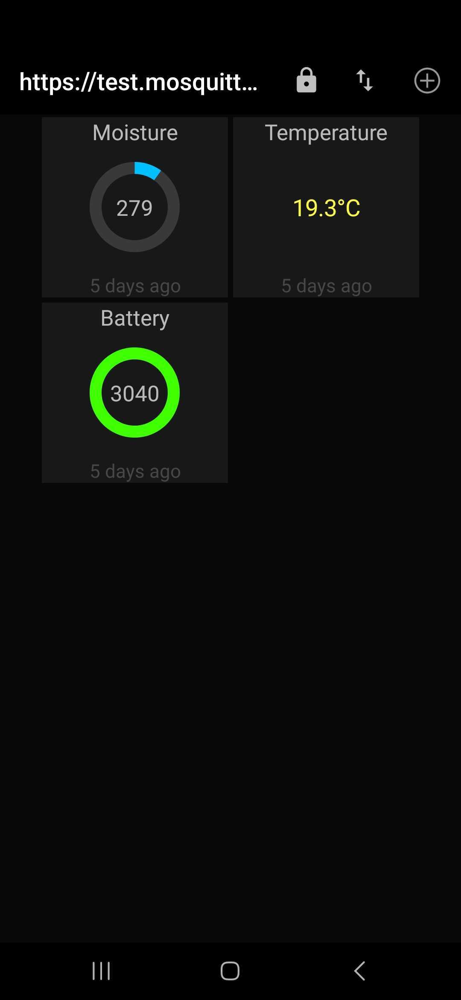
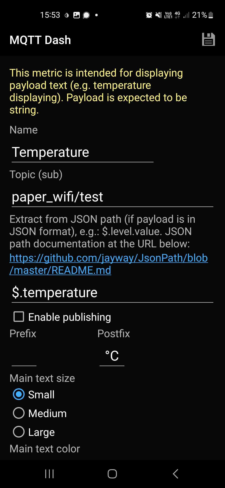
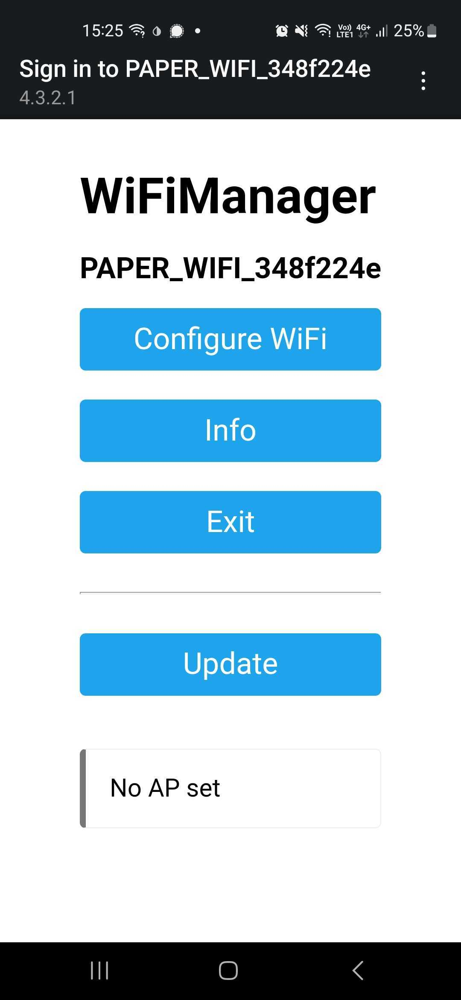
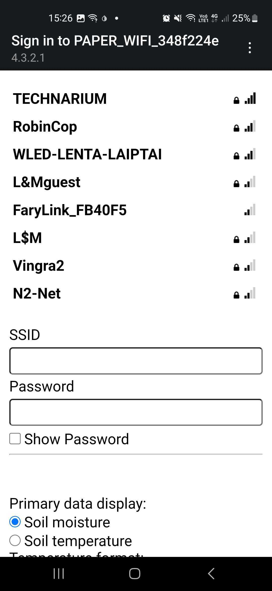
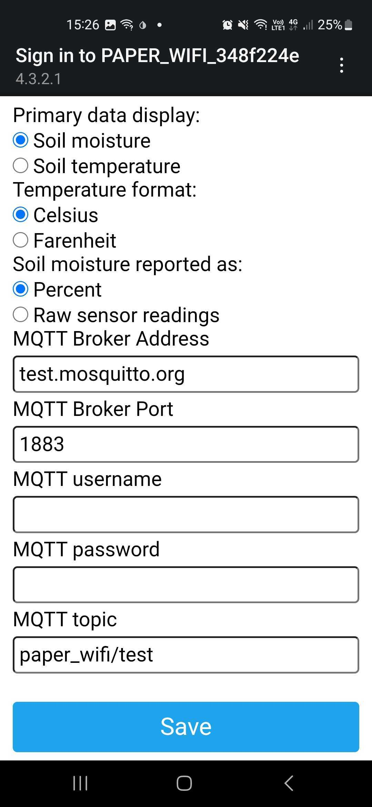

# Getting your data via MQTT
This guide will allow you to see your data being sent via MQTT. Saving data to databases and displaying graphs is another story, but here we will concentrate on getting MQTT running.

## Listening to MQTT messages on your browser 
Open this page on your browser: http://www.emqx.io/online-mqtt-client

Click **New Connection** and make sure you enter these data and click **Connect**:

In the newly opened interface click **New Subscription** 

Enter ** as a topic name and click **Confirm**

Now you are ready to receive MQTT messages!

Once your Paper WiFi starts transmitting you'll see messages posted in this interface:

## Listening for MQTT messages on your phone 

I liked an app called *MQTT Dash*, but you can choose another one. The setup procedure will be similar for any app of the type.

Specify settings outlined below to set up connection to the MQTT broker server.

You can set up several widgets for your data that look like this:

To set up a widget note the format of how it's specified:

## Configuring MQTT on your Paper wifi

MQTT is configured out of the box in the demo firmware, setting these parameters:

| Setting             | Value              |
| ------------------- | ------------------ |
| MQTT Broker Address | test.mosquitto.org |
| MQTT Broker Port    | 1883               |
| MQTT username       | _empty_            |
| MQTT password       | _empty_            |
| MQTT topic          | paper_wifi/test    |

Reset your Paper WiFi board to enter WiFi setup, then connect to it via WiFi. 

Your PC or smartphone should suggest you to open "router configuration" or "captive portal" if it doesn't, open url http://4.3.2.1 to see the configuration page:

Click **Configure WiFi**. The next page will show you a list of WiFi networks visible to the board. Select your network and specify the password for it.

Lower on the same page you'll see MQTT patameters mentioned above:

Don't touch them for now as that's exactly what you have configured in your MQTT client. Click **Save** and wait for a few moments fot the board to connect to your WiFi, make measurements and send them via MQTT. You should be seeing values comming in MQTT client app. 

Note, that the board is configured to send measurements once in 5 minutes, also it won't send a measurement and update display if measurements didn't change from previous measurement.
